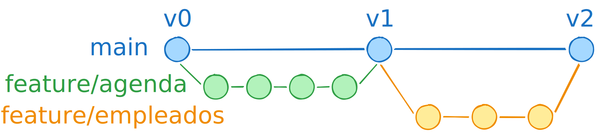
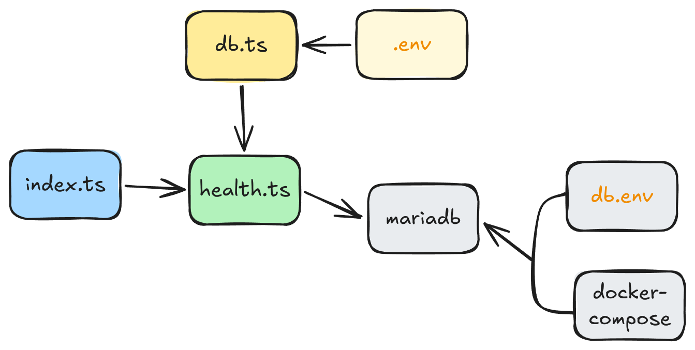

# Modelo de negocio
	- ## Palabras clave
		- 3 Sustantivos
			- Cliente *( id, nombre, telefono )*
			- Servicio *( id, nombre, duracion_min, precio)*
			- Cita *( id, cliente_id, servicio_id, inicio, estado )*
				- estado : ENUM('reservada','cancelada','completada')
		- 3 Verbos
			- Crear
			- Mover
			- Cancelar
-
- # Estrategia de ramas (git)
	- {:height 142, :width 576}
-
-
- # Agenda - Calendario
	- ## 1. **Esqueleto**: monorepo
		- frontent : React
		- backend : Node + Express
		- infra : mariadb
		- ### v0
			- Crear la estructura y entrar
			- Inicializar Git
			- El `.gitignore` raíz
			- El `README.md` de una línea
			- Meter los `.gitkeep` (antes del `add`)
			- El primer commit — v0
		- ### v1
			- Crear el contenerdor para la base de datos.
				- Crear `db.env` con la contraseña del *root* y del *usuario-app*. Es solo para la base de datos.
				  logseq.order-list-type:: number
				  collapsed:: true
					- El usuario *root* se llama así siempre
					- El usuario que usa la app es el que defino. Pero no hace falta calentarse la cabe za con el nombre.
				- Crear `docker-compose.yml`.
				  logseq.order-list-type:: number
				- Crear carpeta *initdb/* con archivos *.sql* para que se ejecute en la primerísima instancia de volumen que se generará.
				  logseq.order-list-type:: number
				- Añadir la línea `./initdb:/docker-entrypoint-initdb.d` a volumes de `docker-compose.yml`.
				  logseq.order-list-type:: number
				- Levantar el contenerdor con *docker compose*.
				  logseq.order-list-type:: number
			- Crear la parte backend
				- `npm init -y`
				  logseq.order-list-type:: number
				- instalar dependencias: 
				  logseq.order-list-type:: number
					- Producción: express, mysql2
					- Desarrollo: typescript @types/node @types/express tsx
				- Definir archivos básicos para el */health*
				  logseq.order-list-type:: number
					- **`src/db.ts`** — el pool de conexión a MariaDB:
					- **`src/routes/health.ts`** — la ruta honesta:
					- **`src/index.ts`** — arranca el servidor
					- 
					- Colocar un `src/.env` con las credenciales para que no lo pille GitHub.
					- Instalar dependencia de producción: dotenv
			- Pasar del */health* a un servicio con rutas.
			-
-
- ### **Esquema + semilla**: las tres tablas y datos inventados (3-4 clientes, `corte`+`uñas`, 5-6 citas repartidas en una semana). *Verificas con un `SELECT`.*
-
- **Backend solo-lectura**: `GET servicios`, `GET clientes`, `GET citas` de una semana. *Verificas con Postman.*
  logseq.order-list-type:: number
- **Frontend solo-lectura**: calendario semanal que **pinta** las citas leídas. ← Aquí llega el momento "papel → pantalla". Es tu recompensa a mitad de camino, y es a propósito: es el antídoto contra saltar del barco.
  logseq.order-list-type:: number
- **Backend escritura**: `POST cita` (crear), `PATCH cita` (mover = cambiar el inicio), cancelar. *Verificas con Postman.*
  logseq.order-list-type:: number
- **Frontend interactivo**: crear (click en hueco → form), mover, cancelar, contra la API real.
  logseq.order-list-type:: number
- **Pulido del calendario**. Aquí la UI sí es producto.
  logseq.order-list-type:: number
-
-
-