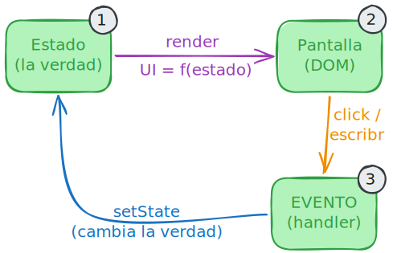
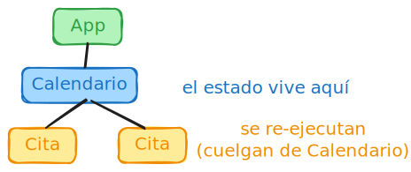
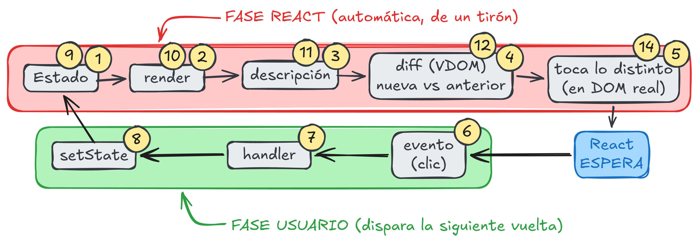

# Bucle de estado
	- No es acceso, es memoria + aviso
	- 
- # Renderizado
	- **Render** :re-ejecute tu función componente. La corre de arriba abajo.
	- El **return** es el resultado esa ejecución; JSX.
	-  
	  Re-ejecuta el dueño del **estado** y sus descendientes.
	- 
	- El diff compara descripción nueva vs anterior del Virtual DOM, no contra el DOM real.
	- `setState` no cierra la vuelta, arranca la siguiente.
- []