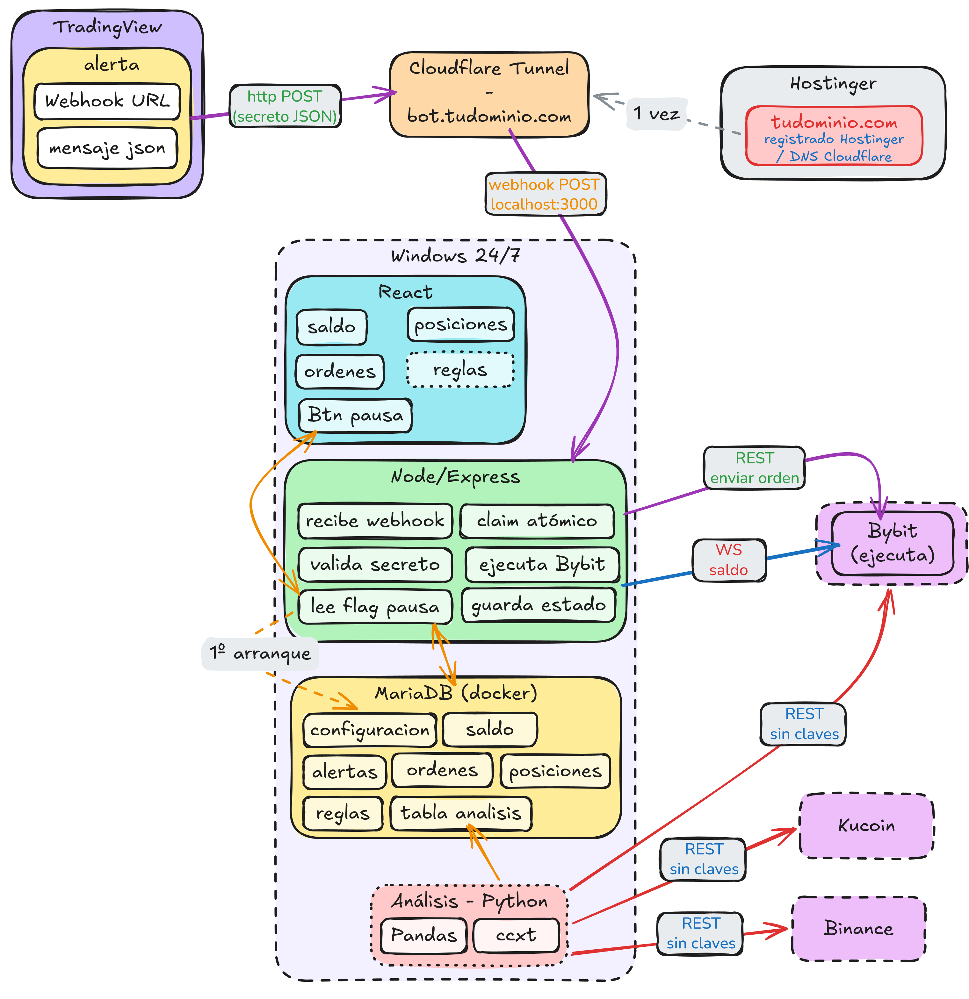

# V1
	- TradingView
	- CloudFlare Tunnel (IP pública - webhook)
	- [Hostinger](https://hpanel.hostinger.com/websites) (dominio)
		- saddlebrown-lapwing-518942.hostingersite.com
		- alexanderlight.es
	- Windows 24/7
		- React
		- Node + Express
		- [[Trading-service/MariaDB]]
		-
	- Bybit (operar)
	-
-
- # V2
	- Análisis - Python
		- CCXT
			- Histórico : OHLCV , varias temporalidades
			- Exchanges : Bybit, KuCoin y Binance
		- Pasar datos a Pandas
			- Transformar datos para incormporar a tabla de MariaDB
-
- # V3
	- React para ver los históricos de Pandas
-
- # V4
	- ML : [SciKit-Learn](https://scikit-learn.org/stable/#)
		- Unas **características** (features): los números que describen la situación.
		- Una **etiqueta** (target): lo que quieres predecir.
			- Coluna de si/no
	- > Cuidado con los datos futuros
- # V5
	- Definir reglas-estrategias, desde la interfaz
- 