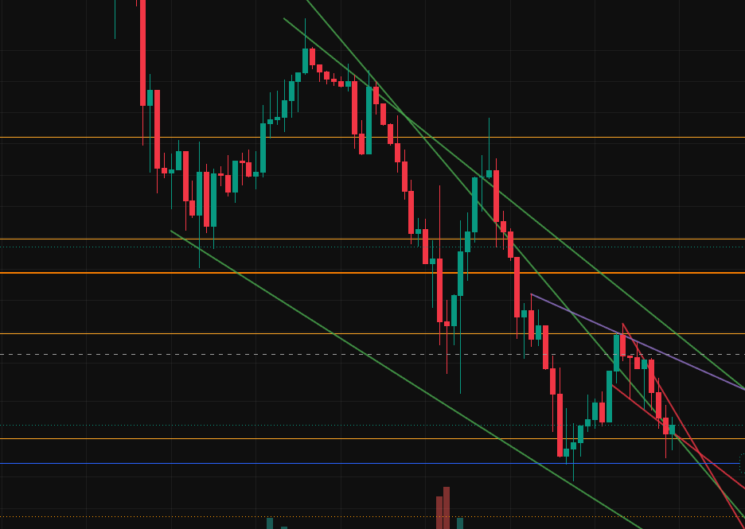

# Curiosidades

## Días de volumen

- Sábados y Domingos : Días calmados y predecibles.
- Por la semana suele haber entre 3 y 4 momentos intensos.
- Distanciados a 20 horas como mínimo y 48 horas como máximo.
	- La 1ª hora del lunes puede haber mucho volumen.

## Temporalidad

- En temporalidad < H1 se toman líneas horizontales
	
	- En temporalidad > H1 se toman líneas diagonales
	- Para fechas concretas se traza una vertical sobre el punto donde se cortan 2 diagonales.
	- Para histórico, en activos y acciones, es suficiente con el semanal.
	- Para histórico de derivados puede ser más práctico el mensual.

# Perfiles
- [alextrades.nq](https://www.instagram.com/alextrades.nq/)
- [smc_tradezone__](https://www.instagram.com/smc_tradezone__/)
- [sanchezzfx](https://www.instagram.com/sanchezzfx/)
- [skylinetradersclub](https://www.instagram.com/skylinetradersclub/)
- [sixlots](https://www.instagram.com/sixlots/)

# Bybit

- No se puede trabajar en futuros, ni apalancado. Porque Bybit no cuenta con licencia MiFID 2.
-
- [[bot-trading/01 - bot_trading]]
-