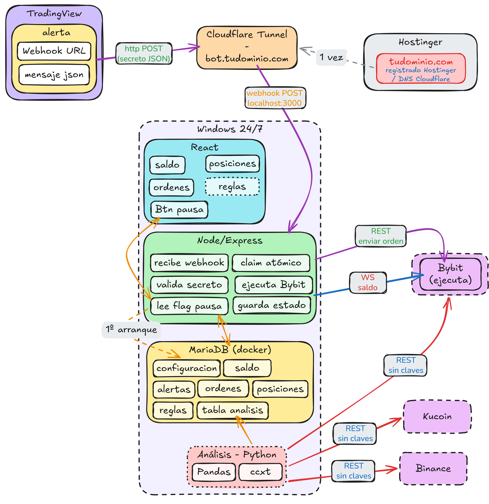

# V1

- TradingView
- CloudFlare Tunnel (IP pública - webhook)
- [Hostinger](https://hpanel.hostinger.com/websites) (dominio)
	- saddlebrown-lapwing-518942.hostingersite.com
	- alexanderlight.es
- Windows 24/7
	- React
	- Node + Express
	- MariaDB
- Bybit (operar)

# V2

- **Reconciliación de posiciones al arrancar**: tu tabla `posiciones` no conoce las posiciones que abriste fuera del bot. Pedir a Bybit el estado real por REST al arrancar y sincronizar. La nombraste hoy tú mismo.
- **Convención de nombres de cuenta** (`op`/`res` vs alternativas): decidir en frío, aplicar cuando actives las cuentas reales. Recuerda: solo letras/números/guion_bajo, porque generan el nombre de la variable de entorno.
- **Reglas N:M** (una regla en varias cuentas) y **capa de monedero** (`cuenta → monedero → moneda`): reestructuración de esquema, v2, van juntas.
- **Fallback del saldo** que no captura string vacío (`disponible: ""`) → puede petar al insertar en DECIMAL.
- **`aplicarFill` y `estadoDe`** sin prefijar `bot_trading.` (se escaparon del refactor).
- **Tipar los payloads del WebSocket** con Zod en vez del `any`.
- **`HABILITAR_FAKES`** en `env.ts` quedó huérfano (el router fake ya no se monta) — limpiar cuando toque.
- **`chmod 600 .env`**; gestor de secretos cuando toque producción.

# V3

- Seguimiento de patrimonio (eBay, ETH sueltos, conversión USD)
- Aviso de `"tipo": "heartbeat"` que se lanza cada hora desde TradingView al bot.
	- Si el bot lleva *2 horas* sin detectar ese aviso, lanza un mansaje a Telegram.
- Análisis - Python
	- CCXT
		- Histórico : OHLCV , varias temporalidades
		  sigo leyendo.
		- Exchanges : Bybit, KuCoin y Binance
	- Pasar datos a Pandas
		- Transformar datos para incormporar a tabla de MariaDB
- React para ver los históricos de Pandas

# V4

- ML : [SciKit-Learn](https://scikit-learn.org/stable/#)
	- Unas **características** (features): los números que describen la situación.
	- Una **etiqueta** (target): lo que quieres predecir.
		- Coluna de si/no
> Cuidado con los datos futuros
	
# V5

- Definir reglas-estrategias, desde la interfaz
	
	